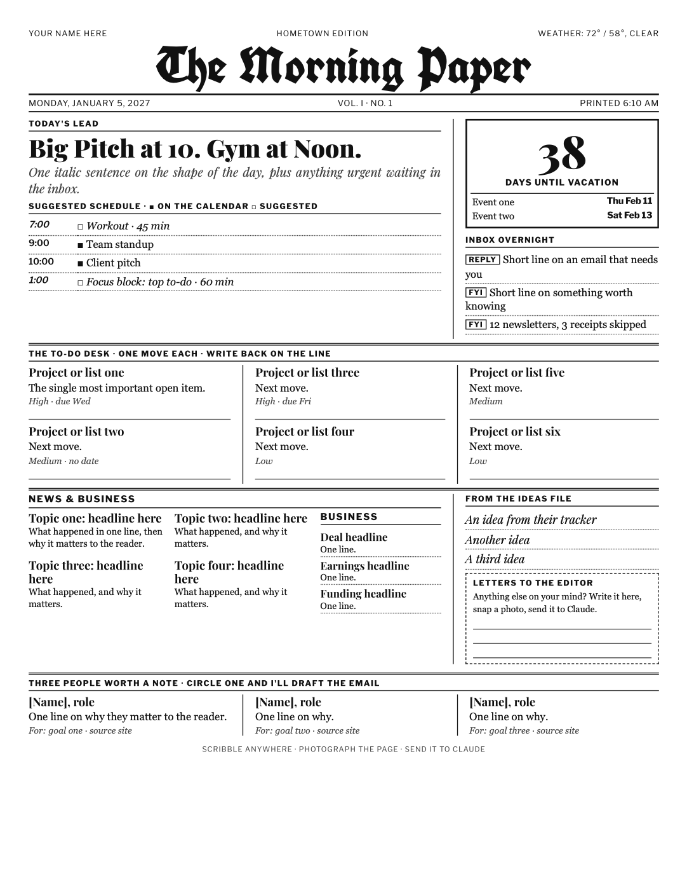

# Morning Paper

A Claude skill that builds you a newspaper-style briefing (one page by default) every morning from your calendar,
inbox, to-do list and the news, then prints it (or emails it to you). You scribble on it, snap a
photo, send it back to Claude, and your notes turn into done items, new to-dos and email drafts.

## Play around with it

This is a base idea, not a finished product. It started as one person's printed morning paper, and it
is meant for you to expand on yourself: add sections, cut the ones you never read, change the news
topics, restyle the template. Just tell Claude what you want different and it edits your setup.

Don't have a printer, or rather not print? Pick email delivery during setup. The paper arrives in your
inbox and you reply to it with your notes instead.

## What it asks you when you set it up

1. **Sections:** tick the ones you want: Today's Lead, Schedule, Countdown (to anything you like: a
   trip, a launch, a race), Inbox Overnight, To-Do Desk, Ideas File, People Worth Meeting, Write-in box.
2. **Time, delivery and length:** when it arrives, which days, print, email, both, or just save the
   PDF, and how long (one page, two pages, or as long as it needs).
3. **News:** yes or no (with an optional Business column).
4. **Sources and topics:** your favourite outlets and up to 4 topics.
5. **To-do list:** where yours lives (Notion, Todoist, Google Tasks, Apple Reminders, a file).
6. **Keeping your computer awake:** do you need help setting that up? (See below.)

Then it builds your first edition on the spot and schedules the rest.

## Heads up: your computer has to be awake

The paper is made by a scheduled task that runs on your computer, in the Claude desktop app. If the
computer is asleep or the app is closed at print time, the paper waits until you open it and arrives
late. Setup offers to walk you through keeping it awake (a power setting, or a scheduled wake just
before print time). Keep it plugged in and leave the Claude app open.

## Install

**Claude desktop app or claude.ai:** download [`morning-paper.skill`](morning-paper.skill), then in
Claude go to Customize > Skills > + > Upload a skill. (Skills need code execution turned on under
Settings > Capabilities.)

**Claude Code:** copy the `morning-paper` folder into `~/.claude/skills/`.

Then say: **"Set up my morning paper."**

## What you need

- Claude with connectors for whatever sections you choose (calendar, email, your to-do app). Setup
  only offers sources you have connected.
- Google Chrome (to render the page to PDF).
- For printing: a printer your computer can reach (macOS or Linux).
- For a paper that is ready when you wake up: the Claude desktop app open and your computer awake at
  print time. On a Mac: System Settings > Battery > Options > "Prevent automatic sleeping on power
  adapter when the display is off".

## Privacy

Your paper is built from your own calendar, inbox and to-do list, so treat it as private.
The skill reads your data while building and does not change anything. The only email it ever sends
is your own paper, to your own address, if you choose email delivery. Replies to people you circle are
saved as drafts for you to review, never sent. Everything it makes stays in a folder on your computer
(`~/Documents/Morning Paper/` by default).

## What's inside

- `morning-paper/SKILL.md`: the setup interview, daily build and reply loop
- `morning-paper/assets/template.html`: the one-page layout
- `morning-paper/references/`: what each section does, and the config skeleton
- `morning-paper/scripts/render_pdf.sh`: HTML to PDF, with a one-page check

MIT licensed. Fork it and make it yours.
